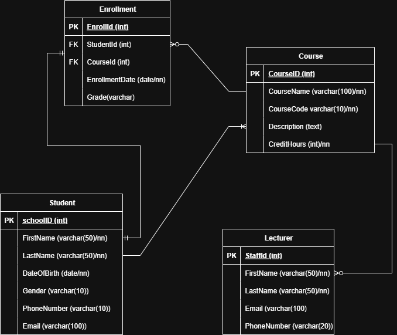
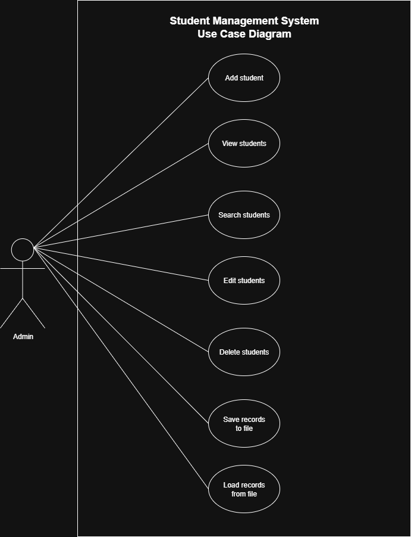

# Student Management System

The Student Management System is a straightforward console application designed to help manage student records. It will provide basic functionalities to interact with student data, making it a perfect learning ground for core C++ concepts like data structures, input/output operations, and basic file handling.

## Project Overview

This project is a collaborative effort to build a simple, terminal-based Student Management System using C++. Our primary goal is:
- Enhance C++ Skills- To collectively improve our C++ programming abilities by working on a practical application.
- Master GitHub Workflow- To gain hands-on experience with fundamental GitHub concepts and best practices, including repository management, branching, committing, and pull requests.

**Planning & Product Discovery**  
View the product planning on [Notion](https://www.notion.so/Student-Management-System-Project-Plan-227f3dd7182f804d9bf1fcc0ae754833?source=copy_link)

## Key Features

- Add Student: Input and store new student records (e.g., Name, ID, Grade).
- View Students: Display a list of all existing student records.
- Edit Student: Modify the details of an existing student record.
- Delete Student: Remove a student record from the system.
- Search Student: Find a student record by ID or name.

## Structure

<pre lang="bash">
.
├── README.md
├── assets
│   ├── student-management-system-erd.png
│   └── student-management-system-use-case.png
├── include
│   ├── student.h
│   └── utils.h
├── src
│   ├── main.cpp
│   ├── student.cpp
│   └── utils.cpp
├── studentApp
└── students.txt
</pre>

## Entity Relationship Diagram



## Use Case Diagram



## How to Run

To compile and run the Student Management System:
##### Prerequistes
- C++ compiler(g++)
- Terminal or command-line environment
##### Build the App
Open your terminal in the project root and run:
```bash
g++ src/main.cpp src/student.cpp src/utils.cpp -Iinclude -o studentApp
```
##### Run the App
```bash
./studentApp
